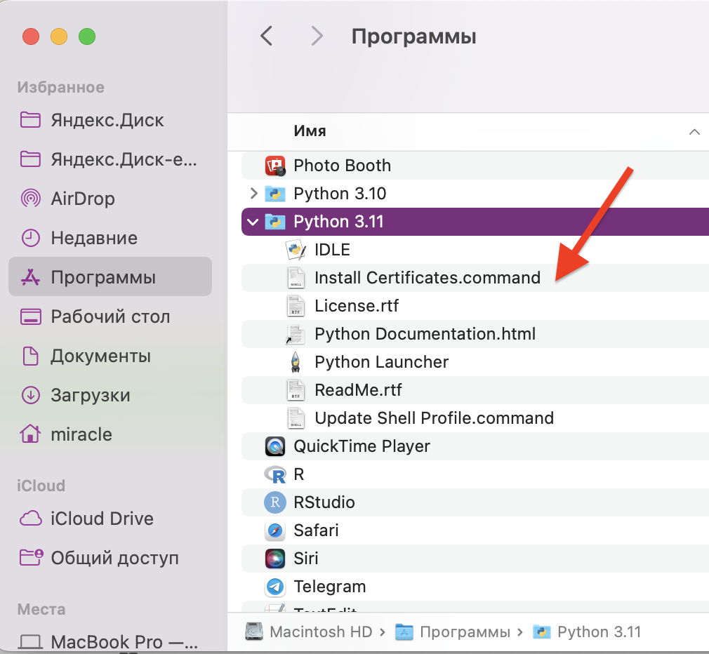

# Python_BI_2022

## Homework #3

OS - macOS Monterey 12.5.1
python - 3.11.0rc2

### Instructions for installation module on macOS

1. Download and nstall pre-release Python3.11

  https://www.python.org/downloads/macos/
  
2. Don't forget to run 'Install Certificates.command' in the directory Python3.11
  
  
  
3. Run command to install packages:
`pip install -r requirements.txt `

> Attention! If you have some versions of Python, make sure you install packages in the correct version of Python. To avoid problems, you can use the command: 
`python3.11 -m pip install -r requirements.txt`